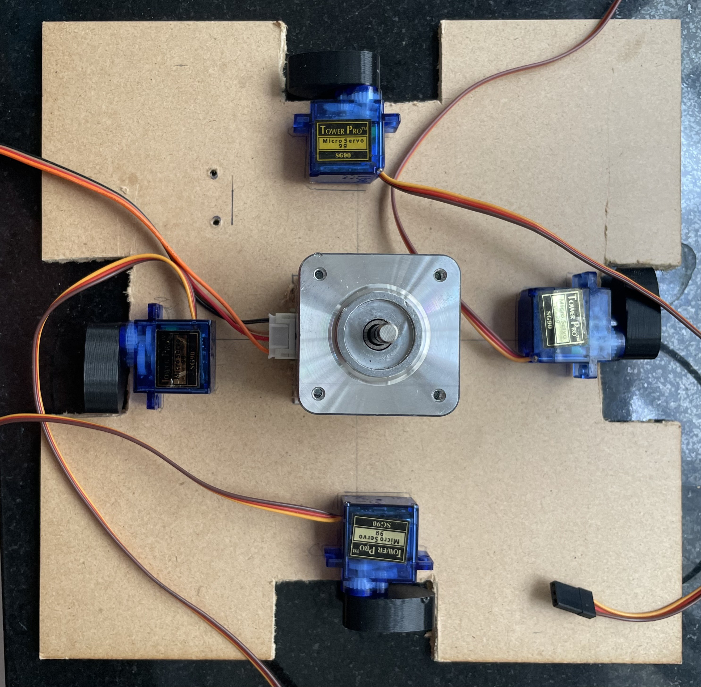
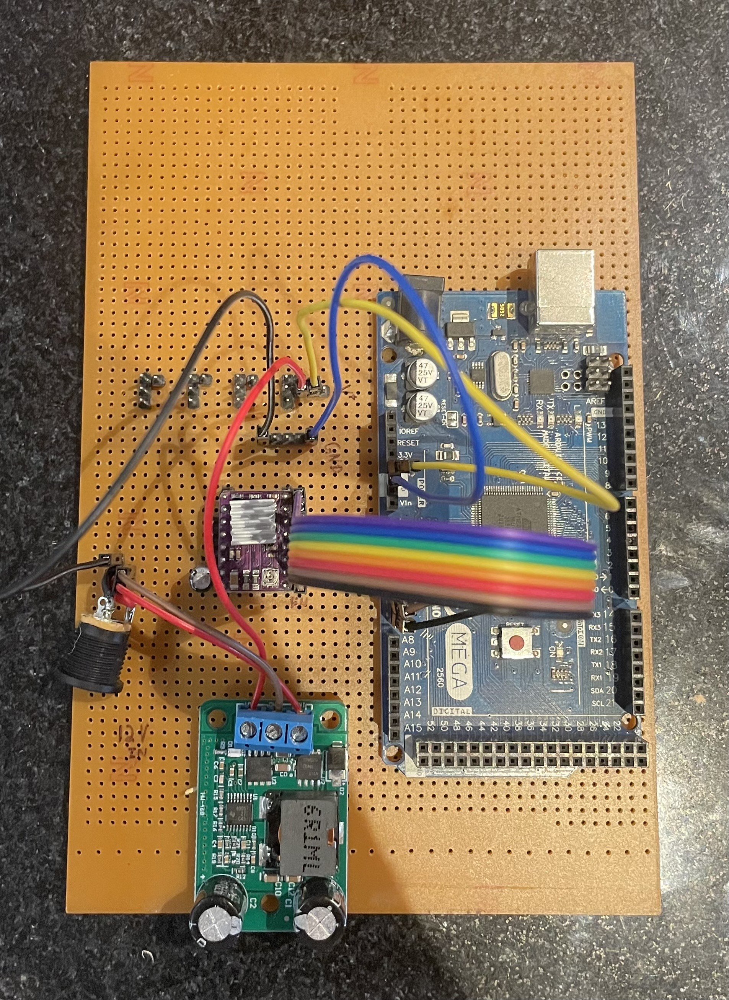

# Card Badging Mechanical Automation

## Phases
+ **Design Phase** (5/26/25 to 5/30/25)
+ **Component Setup and Testing** (Estimated: 6/4/25 to 6/6/25; Actual: 6/2/25 to 6/20/25)
+ **Construction** (Estimated: 6/20/25 to 7/1/25)
+ **Automation** (Estimated: 7/7/25 to 7/10/25)
+ **Refinement + Adding Features**

## Goals
The primary goal of this project is to create an automation that badges card for a user in a certain order. This design must be scalable, quick, and easy to use. It should be flexible as well; my intention is to make this as easy for a team to use as possible.

---

## Design Phase 

### Protoype Design (5/26)

For my first prototype, I'm creating a solution that can badge 16 cards in quick succession. It consists of a drum rotated accurately by a stepper motor. The drum has 16 holes that fit card slots into them, which are lifted by a cam (operated by a micro servo) into the range of a stationary reader. 

In order to scale this design up, an additional cam must be placed under each new reader. Since micro servos are inexpensive, this design is simultaneously cost effective. Ideally, the larger the drum, the more readers can be incorporated.

##### Onshape

This is my first time using Onshape. I spent about a day learning Onshape and how to create models accurate to scale. I then set out to create the models by sketching designs on faces and extruding them as necessary. Throughout the process, the idea behind the design remained relatively unchanged, but I made one significant revision: making the range of motion of the cams a little larger and moving the readers further away from the cards in order to prevent interference/reading multiple cards accidentally. I've also tried to use mates in my model. `Revolute_1` and `Revolute_2` in the Onshape document are fully functional and can be animated, but Onshape does not have a way for me to test a complete workflow.

##### Print (6/2)

I've sent the `.stl` files to be printed by [Robu.in's 3D printing service](https://robu.in/product/3d-printing-service/), which I will receive within a week's time (~6/9/25). The print file is saved as `Assembly2_ver3.stl` in the `3D/` directory, and the final product will look like the contents of `Prototype_Assembly.stl`. Find the Onshape document [here](https://cad.onshape.com/documents/6fe5cb060711fa738a919116/w/fa28f828e5c3d9cb04d2cd20/e/b66991c36ce5bdb22e432e13?renderMode=0&uiState=683d6334979e864c1bc73d1c). 

**Updates**
6/4/25: The print has been delayed, but I will move on to testing components and creating libraries to make the final product easier to construct.

6/9/25: The print was cancelled and refunded because I provided parts that were too large for the printer. The latest print file is stored in `Assembly2_ver4.stl`, in which I've reduced the height of the card slots and increased the size of the cam lift range instead. The prints will hopefully come in by next week (6/16 to 6/20).

---

## Component Testing 

Component List (tentative): Arduino UNO(1), Tower Pro 9g Micro Servos(4), NEMA 17 Stepper motor(1), DRV8825 stepper motor driver(1), 2N7000 N-MOSFETs(4), LM2965S buck converter(1)

### Makefile (6/2)

Since I'm using a more baremetal approach with this project, I'm skipping the Arduino IDE and managing functionality by editing register contents in the ATmega328p IC on-board. Additionally, I'll be using the `avr-gcc` toolchain to compile and flash my code onto the ATmega. For this, I've written a makefile that is heavily inspired by the makefiles I've had to use in college for my embedded systems course. Find the references [here](https://github.com/ProfMcL/ECE231).

### Servos 

I couldn't find any C libraries for the micro servos, unfortunately. However, I managed to create my own simple servo library that functions exactly the same. I've used a general purpose timer on the ATmega, 16-bit Timer 2, to generate a constant Fast PWM signal with a period of 20ms, which is required by the servo according to documentation, and a duty cycle that varies between 5% and 10%. The duty cycle of this PWM wave determines the angle the servo turns to. My function is constructed in such a way that it takes an input from 0 to 180 degrees, maps it to milliseconds, and adjusts the duty cycle by changing the value the timer waits till before it sets the PWM to `LOW` again.

The next step is to create a way to control four servos with the same timer. This is possible, but it requires some tweaking of my library to include taking a servo number as input, as well as NMOSFETs in the circuit to redirect the PWM signal to these servos as required. I will also need to tweak *when* the signal is `HIGH` depending on the servo that is being addressed.

### Stepper Motor (6/9)

I'm currently waiting for the stepper motor driver to arrive (DRV8825). Until then, however, I will work on customizing a library for this driver. Find the library github repository [here](https://github.com/adrielluiz/drv8825_c/tree/main). According to the documentation, I need to provide implementations of setting pins to output and creating a `delay_us()` function. Fortunately, I can just use the `utils/delay.h` library to complete that part. 

I've included `drv8825.c` and its associated header in `lib/`, and I will modify it there. The original author has left in some misspellings of DRV8825 in method and type identifiers, which I have fixed.

The library readme recommends using a certain code structure, which I'll copy into `main.c`. 

Now, I'll modify `drv8825.c`, which contains the methods I need to customize to my chip architecture. Fortunately for me, I will need to connect 8 pins from DRV8825 into GPIO pins (the rest are for power/go into the motor directly), so I can use one full port on the ATmega, which is exactly 8 bits wide/8 pins wide. I'm going to use `PORTD`, as `PORTB` currently is being used for USART. This way, each pin on the DRV8825's right-hand side can be connected directly to PD0-PD7, making the definition of `stepper_pin_set()` incredibly easy to implement via simple bitwise operations. Since PD0-PD7 are organized perfectly in order on the board, the connections will also be satisfyingly clean.

Note that in `drv8825.h`, the `enum drv8825_drv_pins_e` typedef is ordered significantly differently than that of the original author in order to implement `stepper_pin_set()` as described.

Once the DRV8825 comes in, I can test the stepper and the driver simultaneously, and I can conclude this phase. 

Update(6/16/25): The driver component has come in. I completed testing on 6/18, primarily because I was trying to understand why my motor was not receiving any current from the drv8825 at all. Apparently I had misunderstood the pinout on the board. The pins 2A, 1A, 1B, and 2B are outputs to the stepper motor, in that order. The NEMA 17 stepper motor has four input wires, or two pairs of wires that connect to two electromagnetic coils in the inner workings of the motor. I was connecting each pair to the driver by number rather than letter; i.e. I connected one pair to 1A and 1B and another to 2A and 2B. This did not work, and I was about to return the driver, but after trying some permutations of the four wires, I realized that the combination that I needed to use was by letter, i.e. one pair to 1A and 2A, and another to 1B and 2B. 

### NMOSFETs (6/16)

For the NMOSFETs selecting the correct servo, I will need to create a breakout board, since they are so small. I'll use this both to test them and for the final construction. Additionally, I want to make it flexible, so that I can operate 1,2,3, or 4 servos depending on the workflow needed.

I'm thinking of using 4 pins on `PORTB`. Depending on the servos necessary, I can set `PORTB` with bitwise operations; however, I do need to consider moving multiple servos to different angles in the same 20ms period. In order to do this, I need to partition the 20ms period into 4 parts (one for each servo), and update the timer to increase or decrease the pulse width according to the angle. This means I will need to heavily modify my `servo_set_pos()` method. In addition to this, I will need to ensure that despite 'partitioning' the timer signal into four parts, each servo still receives a signal with period 20ms, or the servo will exhibit unexpected behavior.

For testing, I'll send a constant `HIGH` through the drain terminal, read the output on the source terminal, and constantly vary the gate voltage between 5V and 0V (1 and 0). The output should be exactly the same as the gate input(`HIGH` or `LOW`). I may also have to use resistors on the terminals depending on their rating. 

## Modification and Adjustments (6/24)

### NMOSFET Removal

I've further researched and tested the NMOSFETs; unfortunately, I won't be able to use them, as the process is too tenuous to perform consistently, especially when the stepper and other devices are factored in. This is a result of the servo's very restrictive functionality: it must constantly be supplied with a PWM signal of period 20ms. In order to implement the NMOSFET switching mechanism, each servo needs to be assigned 5ms of time for its dedicated duty cycle. However, my uart library and any delays that I incorporate into the design will create tiny delays in the lower level workings of the chip. With the context of 20ms, a small delay could be significant. Overall, the 20ms requirement will not always be satisfied because my ATmega will be busy handling other tasks while driving the servos, which means they will be jittery, leading to an unsatisfactory, slow solution.

Instead, I will use a second timer on ATMega328p. This will be significantly more straightforward, as each timer has two PWM outputs, and I can simply modify duty cycles depending on the servo that needs to rotate. Now, I'm faced with additional topics to address.

First, I only have one 16-bit timer on the ATmega328p, called Timer1. The other two timers, Timer0 and Timer2, are 8-bit timers. It is recommended not to use Timer0, as it is involved in core processes, such as delays. Therefore, I need to use one 16-bit timer and a 8-bit timer. Each timer has two outputs that can be controlled independently(OCxA and OCxB), so that's four servo motors. To make functionality consistent, I will emulate Timer2 (8bit) as closely to Timer1 as possible. If this does not work, I have a ATmega2560 that I can swap the ATmega328p with. Unlike the 328p, it has four 16-bit timers, and will be much simpler to work with.

Second, I have to consider moving some of the pins around. PD3 is OC2A, or output compare 2A. This is one of two outputs from Timer2. Since this pin is irreplacable, I will 'shift' some pins on the DRV8825 up one pin, and solder the EN pin to ground permanently. I'll use the SLP pin to reduce power usage by the stepper motor instead.

### Power Adjustments 

I would like the final design to be convenient to use. A single power supply would be extremely useful in that case, rather than supplying the ATmega with a separate USB 5V DC supply, I just power the entire thing with the 12V being used to power the stepper motor. For this, I'm ordering a buck converter, that efficiently and reliably 'steps down' the input voltage to a smaller output voltage. I'm going with a LM2596S buck converter and will connect it in parallel to the stepper motor input power coming in from the 12V DC supply. The output can then go to the Arduino UNO's Vin pin. 

I will also use this supply to power the four servos, as they each can spike at 700mA+ under load, potentially causing errors in logic if all of them are powered by the UNO. Additionally, I will include a 470-1000uF capacitor to smooth out current.

### Servo Library

I need to modify my `servo_set_pos()` method to take another parameter, and use a simple switch-case block to modify the correct output compare register (OCRxA/OCRxB) based on which servo needs to be modified. I'm reusing the mapping from degrees to milliseconds from the previous implementation of this method. 

I've decided this is how I will connect my servos:

Servo 1: OC1A - PB1 (Arduino D9)

Servo 2: OC1B - PB2 (Arduino D10)

Servo 3: OC2A - PB3 (Arduino D11)

Servo 4: OC2B - PD3 (Arduino D3)

Additionally, I need to set up Timer1 and Timer2 to behave similarly. I will put both in Fast PWM mode with TOP = ICRx, and set TOP to 255. In other words, this makes the timer count to 255 before resetting/triggering an interrupt. I'll set both to 255, since the 8-bit timer can only count to 255 (even though the 16-bit timer can count to 65535). I then need to prescale both of them identically, such that after 255 counts, approximately 20ms have elapsed. 

Math:

$\frac{255}{(20*10^{-3})} = 12750$ counts/second

Original clock speed = 16MHz

$\therefore \frac{16000000}{12750} = 1254$

The maximum prescaler value on the timers on the ATmega328p is 1024. If we use 1024 as the prescaler for the timer clock, it results in a period of 16.4ms. This will not work; instead, I'll use an Arduino Mega, with a ATmega2560, and use two of its four timers. 

### Adaptation for ATmega2560 (7/1)

Since I am moving everything to an ATmega2560 for the additional timers, I have several things to update: the makefile, the DRV8825 `stepper_pin_set()` function, and the custom servo library. I will make these changes in a directory labeled `Final_Build/`, where I will store all the code that is fully functional and ready to go.

I will use the following pins on the 2560:

Pin name  |  Purpose

PortF 0:7 | DRV8825 EN:DIR

OC1A(PB5) | Servo 1 PWM

OC1B(PB6) | Servo 2 PWM

OC1C(PB7) | Servo 3 PWM

OC3A(PH3) | Servo 4 PWM

OC1x means Timer1 and OC3x means Timer3; both timers are 16-bit, and can easily manage a 20ms period waveform. Since the DRV8825 `stepper_pin_set()` function is adapted for a single port, I don't need to make too many changes(I just have to change `PORTD` to `PORTF`)

While modifying the makefile for the 2560, I ran into a slight issue. The programmer that is typically used by the Arduino IDE to flash to the Arduino Mega 2560 is called 'wiring', only offered in newer versions of `avrdude`, the tool I use to flash and compile. My version of `avrdude` was last updated in 2010, so it didn't have 'wiring' as an option. It took me a while, but I found a workaround, where I call the avrdude version used by the IDE instead of the one I have installed (also in my PATH). In the makefile, this shows up as two file paths, one for `avrdude.exe` and the other for `avrdude.config`, which are configurations I need to use the latest version. None of this will affect the actual `.hex` flashed to the ATmega, but I decided it was important to mention this roadblock. 

---

## Construction (6/26)

While modifying the servo design, I am simultaneously working on constructing the mechanism for the final automaton. I've attached the stepper to the center of a base made of wood, and have fixed the drum to the top of the motor. I've marked the areas where the servos need to go, and have cleared out the area which they require to rotate. I've sanded down the card slots for smoother up-and-down motion in the drum (the original texture from the 3D printer was hindering movement significantly). If required, I will apply grease to the slots, but with the current loose fit of the slots into their holes, I believe that's not entirely necessary. While doing this, I realized I should have rounded the edges of the sticks connected to the card slots in the 3D model for easier movement when in contact with the pear cam, but I sanded down the edges to a satisfactory degree; combined with the restricted degrees of freedom offered by the drum, this will work just fine. 

Along with this, I've constructed a clean perfboard with all the functionality discussed so far: 

The DRV8825 connects directly into the board, and an array of 8 pins goes from the UNO PortD (Digital pins 0 to 7, excluding 3) into 8 female headers into the driver. **Note**: The design has been switched to an Arduino Mega. Therefore, these 8 pins will alternatively be connected into PORTF on the ATMega2560, digital pins 54 to 61. 

There are four sets of 3 male headers in the board for connections to the servo motors. These have their GND pins connected together in parallel. Similarly, the VCC pins are connected in parallel. I've included additional male headers for GND and V+ connections as power rails on the perfboard(5 GND, 3 V+).  

(7/2): I've added guide rails to each card slot to ensure they don't spin when they are being raised.

---

## Automation (7/3)

The final step is to have the stepper and servos work simultaneously. 

There was a slight issue in calculating the pulse width being sent into the DRV8825's STEP pin, which made rotations and the entire `drv8825_move_steps()` function incorrect. The issue was in the division: the original author included a divisor of the number of steps the user wanted to move. However, this number is already being used to generate the pulses in the `for` loop, which means that dividing the pulse width by the number of steps created massive inaccuracies. Instead, in the calculation, I replaced the `steps` parameter with the `steps_per_revolution` variable defined in the driver settings, and this did the trick.

After some testing, I've determined that the number of (full) steps between each card slot is approximately 15. I will need to account for slight inaccuracies due to the limitations of a NEMA17 stepper motor, so I will most likely use the maximum number of microsteps. Upon further testing, I've concluded that using an 8x microstep setting and then running 102 microsteps yields very accurate results.

I'll define a function to convert card 'numbers' into the number of steps needed by the stepper to rotate to a card from it's current position. I will also need to keep track of which slot 'number' the stepper is at, while ensuring that the stepper takes the fastest route possible (i.e. rotates in the direction that is most efficient movement-wise).

---